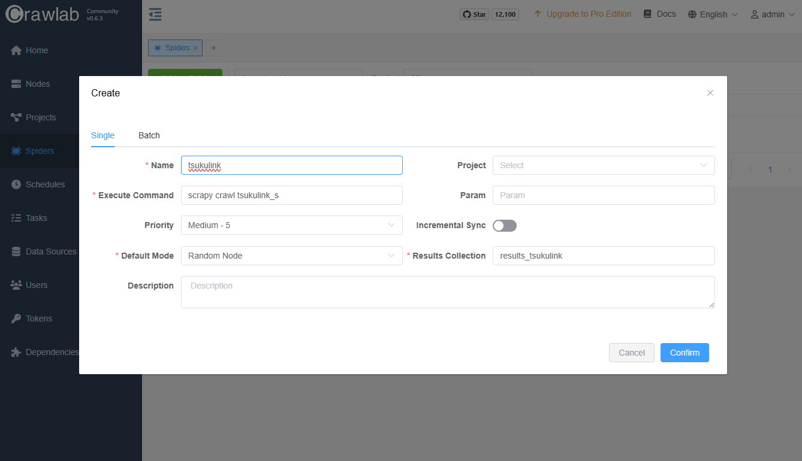
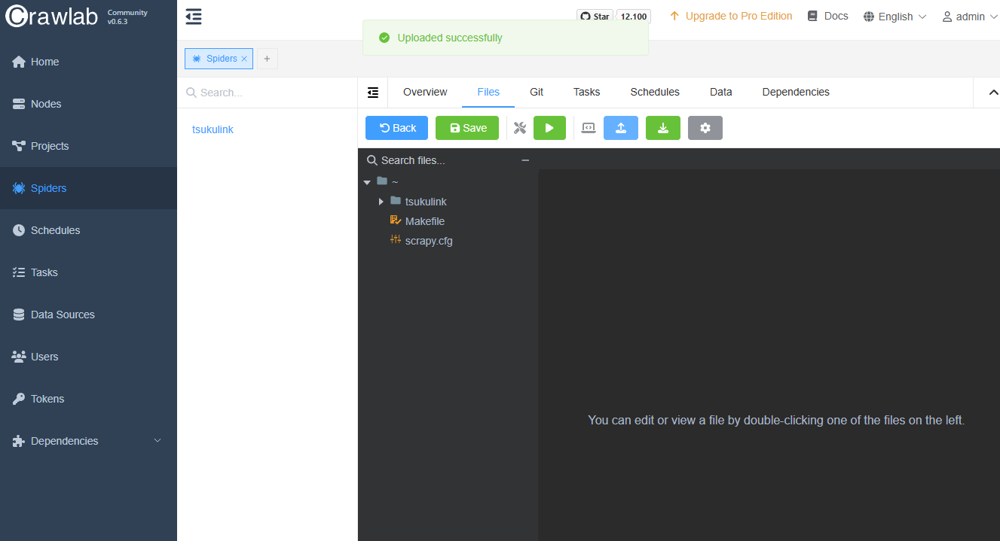
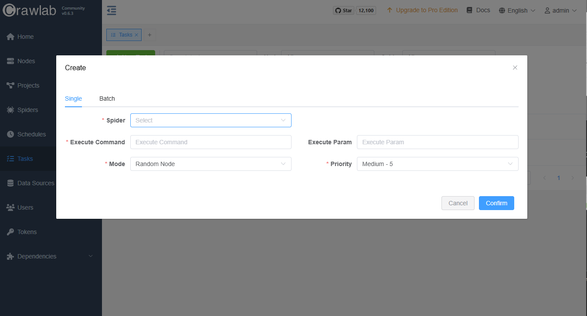

このマニュアルはテンプレートの設定が完了していることを前提としています。

# スクレイピングの始め方
scrapingのコードは基本githubで管理しようとおもうのでまずレポジトリを作成してください。

https://github.com/orgs/STREAM-inc/repositories

名前はscraping-\<name>に統一してください。

## テンプレートの起動
wslを開いて以下のコードを実行
```sh
cd
mkdir -p scraping
cd scraping
start-scraping.sh <name> <host>
```

nameはわかりやすいサイト名とかで、hostはexample.comとかの部分です。

例えばつくリンクの場合は
```sh
start-scraping.sh tsukulink tsukulink.net
```
みたいになります。

完了すると\<name>のフォルダがあると思いますのでそこに移って作業してください。引き続きtsukulinkの例でいうと

```sh
cd tsukulink
code .
```

## 実行
コードが書き終わったら
```sh
make debug
```
で実行をためすことができ、output.jsonが出力されます。

## デプロイ
できたコードはいったんgitにpushしておいてください。

gitを初期化していない場合はプロジェクトフォルダー内で
```sh
git init 
git remote add origin git@github.com:STREAM-inc/scraping-tsukulink.git
```

git pushがはじかれる場合は
```
ssh-keygen
```
このコマンドで生成された公開鍵をgithubに登録してください
```
cat ~/.ssh/id_rsa.pub
```
この鍵である場合が多いです。


[crawlab](http://192.168.100.9)にアクセスしてログインします

user: admin

password: streamcrewadmin

### スパイダーを作成
nameには \<name>

execute_commandは scrapy crawl \<name>_s

で登録してください。


### コードのアップロード
作成されたスパイダーの名前を押すとfilesというのがありそこでテンプレートによって作成されたフォルダをアップロードしてください。



こんな感じになっていたらおっけいです。

### 実行
今後templateに追加するつもりなのですが、コードエディタでyieldしているところを

```python
from crawlab import save_item
```

これを先頭に追加してyieldをsave_itemに変えてください。

```python
#yield item

save_item(item)
```

タスクのページに行って、spiderを選択して実行を開始してください。

